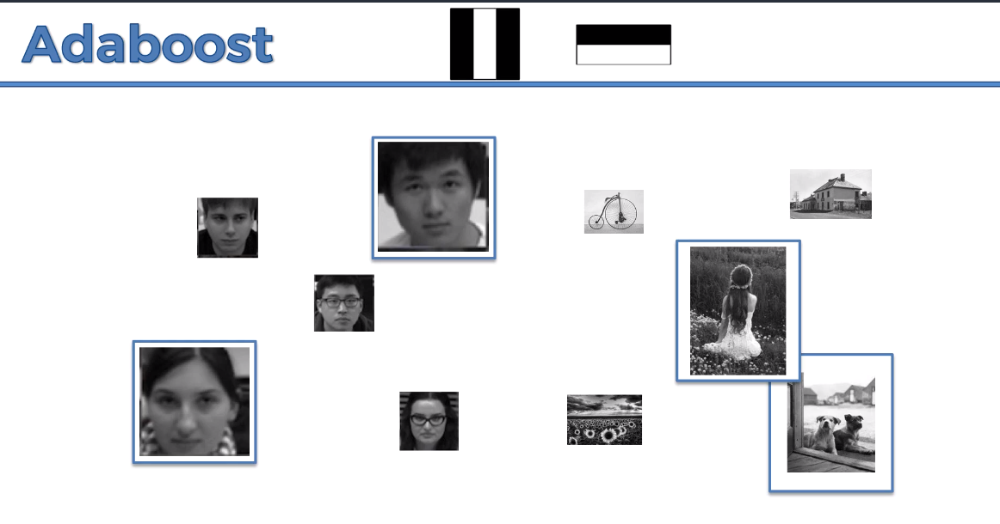

# Viola-Jones Algorithm

* Computer vision algorithm
* Consist of two steps:
	1. Training
	2. Detection

* First step before anything the alg turns the picture in gray scale.

## Detection
* Starts from top left corner of the image
* Looks for different features that define a face
	* If the box that encloses pixels does not find a feature it moves and
	does not count it
	* If it finds most the features of a face then it highlights the box and
	detects.

**Example:** 

# Haar-Like Features 
* There are three base Haar-Like Features:
	1. Edge Features
	2. Line Features
	3. Four Rectangle Features

**Haar-LikeFeatures:** 

**Example:** 

## How are Haar Like Feature determined?
* The Viola-Jones alg takes how close to white/black the pixel is using 0-1(most black)
* Calculates the average of B side and W side
	* B-W = threshold (should be close to 1)

**Example:** 

# Integral Image

* It makes counting getting the threshold of the pixels faster
* Making an integral image you add the boxes upward and to the left of it and itself to put the number in its box

**Example:** 
* note in the picture the numbers are scaled by 10

# Training Classifiers

* How do we determine the common features of a face?
	* Train the alg a bunch of face pictures

* Training helps determine the threshold for the features

**Steps for training**: 
	1. Shrinks the image to 24px x 24px (so there are less combinations of features)
	2. Apply common features for the images

* Input the right images (face images)  - so it knows what features are important
* Input the wrong images (other images) - so it knows what features are not important

# Adaboost(1st thing that speeds up training)
* The number of features that can fit in the 24px x 24px is 180,000+ 
	* Because the features are scalable 
	* Training become impossible 
		**This is where adaboost comes in**

F(x) = a_1 f_1(x) + a_2 f_2(x) + a_3 f_3(x) + …

F(x) is the classifier(strong classifier)
a_i is a weight of a feature
f_i is a feature  (could be a line feature)

a_i * f_i is a weak classifier

## Intution of ada boosting 
* Lets say you have 5 faces an 5 non -faces

* Say during training we want to id the most important features
	* Apply the line feature (nose feature) to the images
	* It could find the feature on three of the faces and two of the non faces

* Then looking for the next feature it then magnifies the weight making the next classification more important

* When the alg keeps finding the feature it magnifies each time making it a strong classifier

# Cascading  (2nd thing that speeds up training)

* If the image does not have the top arbitary features it will stop identifying the features of the others
